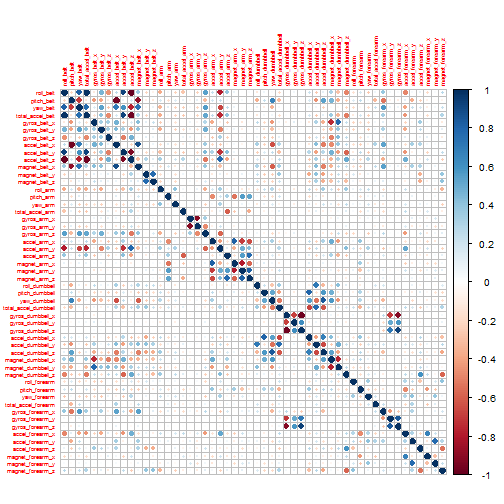
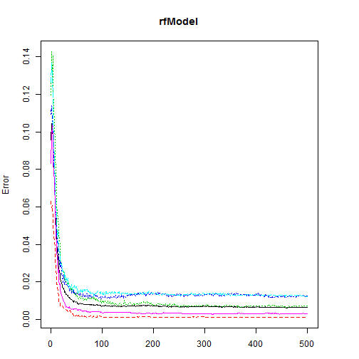
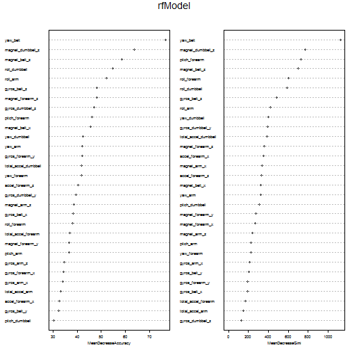

# Introduction
Using devices such as Jawbone Up, Nike FuelBand, and Fitbit it is now possible to collect a large amount of data about personal activity relatively inexpensively. These type of devices are part of the quantified self movement - a group of enthusiasts who take measurements about themselves regularly to improve their health, to find patterns in their behavior, or because they are tech geeks. One thing that people regularly do is quantify how much of a particular activity they do, but they rarely quantify how well they do it. In this project, the goal will be to use data from accelerometers on the belt, forearm, arm, and dumbell of 6 participants. They were asked to perform barbell lifts correctly and incorrectly in 5 different ways


# Loading the data


```r

library(RCurl)
```

```
## Loading required package: bitops
```

```r
setInternet2(TRUE)


trainURL <- "https://d396qusza40orc.cloudfront.net/predmachlearn/pml-training.csv"
testURL <- "https://d396qusza40orc.cloudfront.net/predmachlearn/pml-testing.csv"
download.file(trainURL, "pml-training.csv")

download.file(testURL, "pml-test.csv")

training <- read.csv("pml-training.csv", na.strings = c("NA", ""))
testing <- read.csv("pml-test.csv", na.strings = c("NA", ""))
```


The data has now been downloaded. Let us examine it.


```r
dim(training)
```

```
## [1] 19622   160
```


The training set consists of 19622 observations of 160 variables, one of which is the dependent variable as far as this study is concerned. However, inspection of the data set indicates that many of the 159 predictors are missing in most of the observations


```r
sum(complete.cases(training))
```

```
## [1] 406
```


## Clean the data and remove na values


```r
var <- names(training)[apply(training, 2, function(x) table(is.na(x))[1] == 
    19622)]
train2 <- training[, var]
test2 <- testing[, c(var[-length(var)], names(testing)[length(testing)])]
```


# Discard not useful predictors


```r
removeIndex <- grep("timestamp|X|user_name|new_window|num_window", names(train2))
train3 <- train2[, -c(removeIndex, length(train2))]
test3 <- test2[, -c(removeIndex, length(test2))]
```


We need to check the near Zero covariates and correlation matrix  and remove zero covariates


```r
library(caret)
```

```
## Loading required package: lattice
## Loading required package: ggplot2
```

```r
nzv <- nearZeroVar(train3, saveMetrics = TRUE)
nzv[nzv$nzv, ]
```

```
## [1] freqRatio     percentUnique zeroVar       nzv          
## <0 rows> (or 0-length row.names)
```

```r

corrM <- cor(train3)
library(corrplot)
corrplot(corrM, method = "circle", tl.cex = 0.5)
```

 

```r

highCorr <- findCorrelation(corrM, cutoff = 0.75)
train4 <- cbind(classe = train2$classe, train3[, -highCorr])
test4 <- test3[, -highCorr]
```


We have now removed correlated covariates.

# Split data for model evaluation

We now split the updated training dataset into a training dataset (75% of the observations) and a validation dataset (25% of the observations). This validation dataset will allow us to perform cross validation when developing our model.


```r
set.seed(1234)
inTrain = createDataPartition(train4$classe, p = 3/4)[[1]]
trainPart = train4[inTrain, ]
testPart = train4[-inTrain, ]
```


We now use the Random Forest algorithm to predict


```r
library(randomForest)
```

```
## randomForest 4.6-7
## Type rfNews() to see new features/changes/bug fixes.
```

```r
rfModel <- randomForest(classe ~ ., data = trainPart, importance = TRUE, ntrees = 500)
print(rfModel)
```

```
## 
## Call:
##  randomForest(formula = classe ~ ., data = trainPart, importance = TRUE,      ntrees = 500) 
##                Type of random forest: classification
##                      Number of trees: 500
## No. of variables tried at each split: 5
## 
##         OOB estimate of  error rate: 0.63%
## Confusion matrix:
##      A    B    C    D    E class.error
## A 4181    3    0    0    1   0.0009558
## B   12 2828    5    1    2   0.0070225
## C    0   13 2535   19    0   0.0124659
## D    0    0   24 2383    5   0.0120232
## E    0    0    2    6 2698   0.0029564
```

```r

par(mar = c(3, 4, 4, 4))
plot(rfModel)
```

 

```r
varImpPlot(rfModel, cex = 0.5)
```

 


We now test the sample


```r
out.test <- predict(rfModel, testPart)

out.test <- predict(rfModel, test4)
out.test[1:20]
```

```
##  1  2  3  4  5  6  7  8  9 10 11 12 13 14 15 16 17 18 19 20 
##  B  A  B  A  A  E  D  B  A  A  B  C  B  A  E  E  A  B  B  B 
## Levels: A B C D E
```


